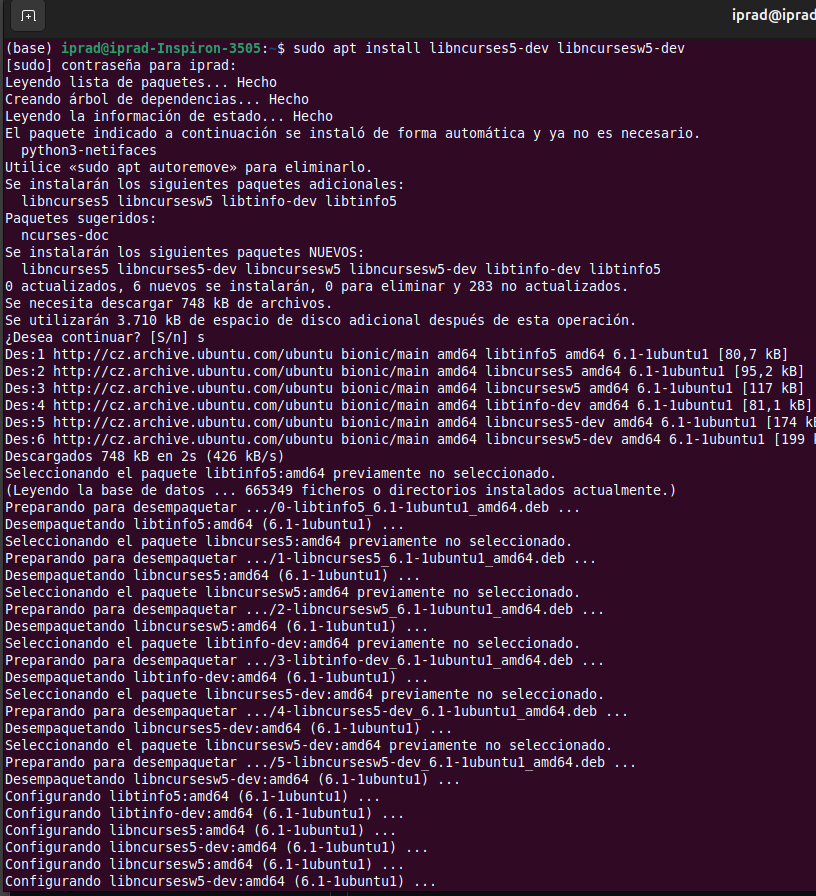
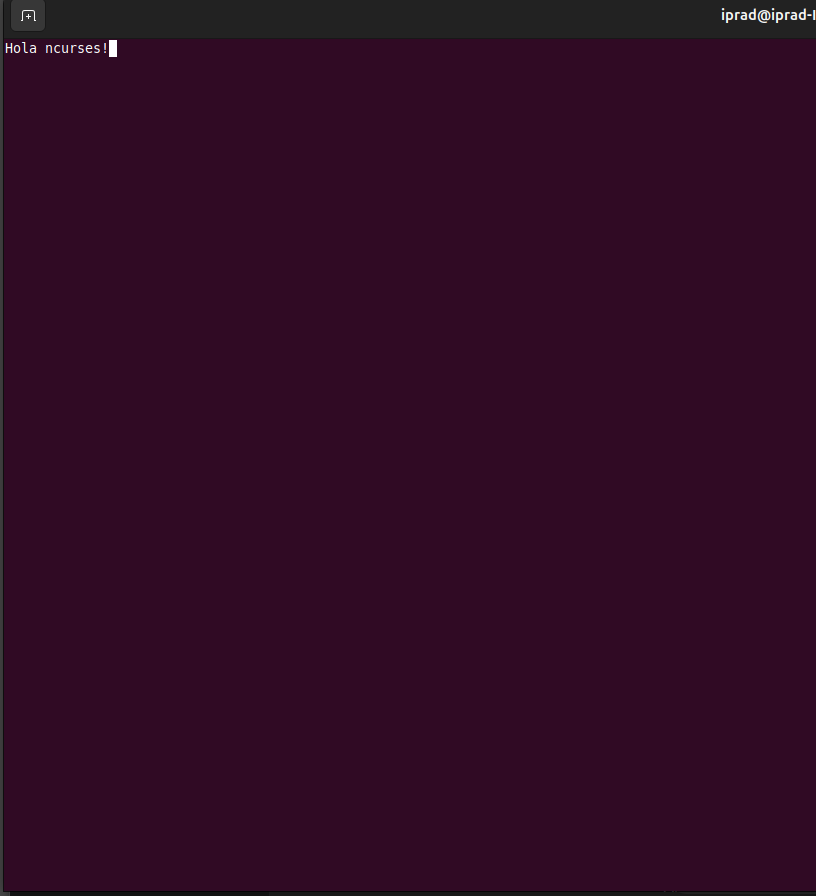
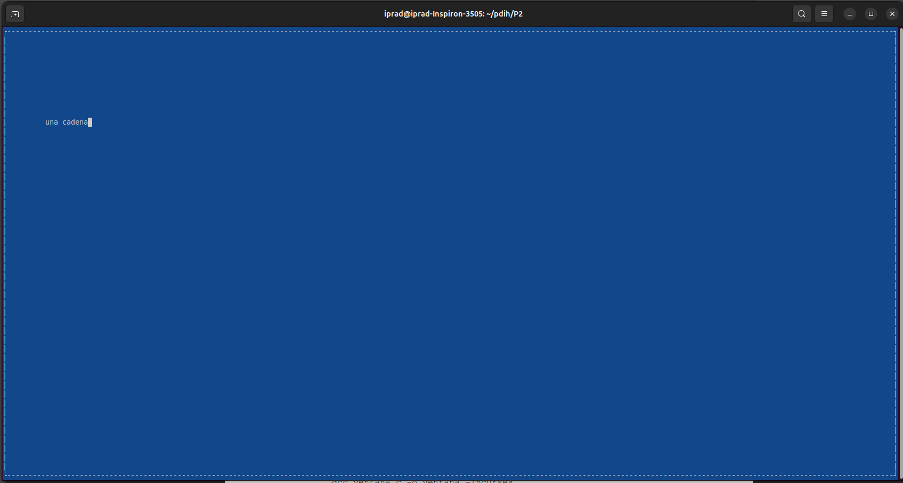
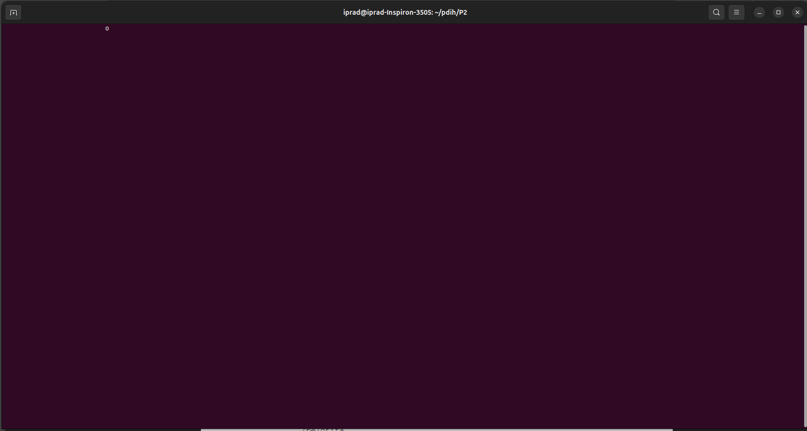
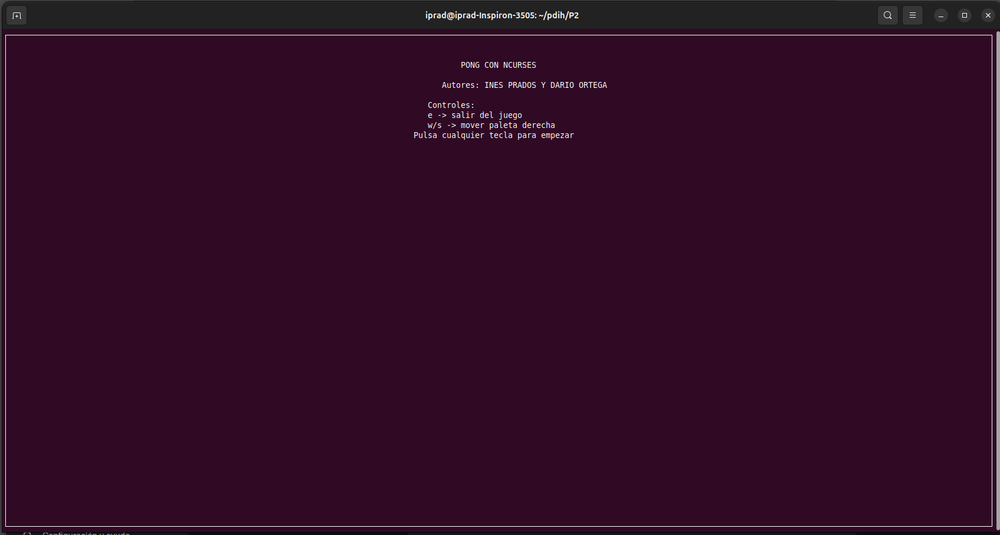
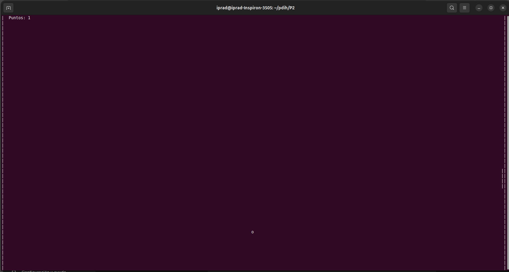
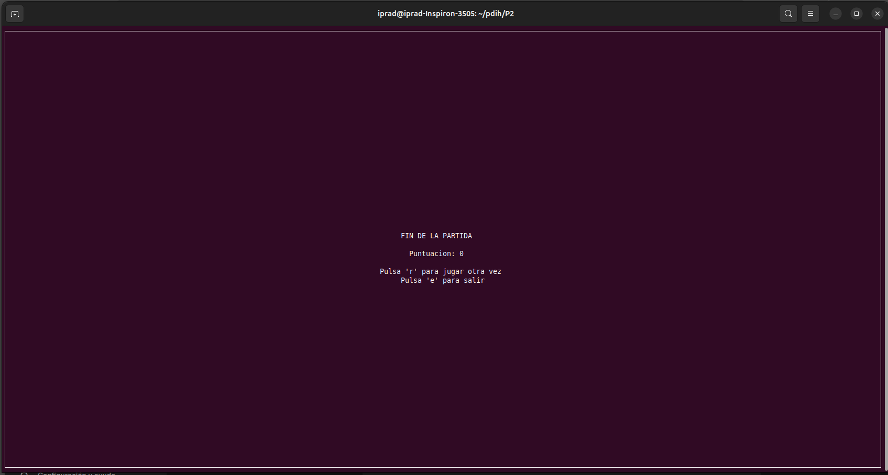

# Práctica 2: Programación con Ncurses

**Autores:** Inés Prados y Darío Ortega
**Asignatura:** Programación de Dispositivos e Interfaz de Hardware (PDIH)

---

## 1. Instalación de la librería ncurses

Para poder desarrollar y compilar aplicaciones de terminal interactivas en Ubuntu, es necesario instalar las bibliotecas de desarrollo de ncurses. El proceso de instalación se realizó a través del gestor de paquetes `apt`, ejecutando el siguiente comando en la terminal:

`sudo apt-get install libncurses5-dev libncursesw5-dev`

Este comando instala tanto la versión estándar como la versión compatible con caracteres anchos (wide-character) necesarios para una correcta visualización. Para compilar los programas desarrollados, utilizamos `gcc` enlazando explícitamente la librería con el flag `-lncurses`.



---

## 2. Programas de Ejemplo

Antes de abordar el proyecto final, desarrollamos los programas de ejemplo propuestos en el guion para familiarizarnos con el control de pantalla, el posicionamiento del cursor y el manejo de ventanas.

### 2.1. Hola Ncurses (`hello.c`)
Un programa básico para inicializar el modo ncurses, imprimir una cadena y esperar la pulsación de una tecla.



### 2.2. Manejo de Ventanas (`ventana.c`)
Programa que demuestra la capacidad de crear sub-ventanas independientes dentro de la terminal principal utilizando la función `newwin()`.



### 2.3. Animación Básica (`pelotita.c`)
Implementación de un bucle de refresco continuo usando `usleep()` para crear la ilusión de movimiento de un carácter que rebota en los bordes.



---

## 3. Proyecto Final: Juego PONG (`pong.c`)

El ejercicio principal de la práctica consiste en la implementación de una variante para un jugador del clásico juego Pong. 

### Características implementadas:
* **Menú de inicio y fin:** Pantallas de presentación y de *Game Over* con opciones para reiniciar o salir.
* **Rebote físico:** Detección de colisiones contra las paredes superior, inferior, izquierda y contra la pala del jugador.
* **Control asíncrono:** Uso de `nodelay(stdscr, TRUE)` para permitir que la pelota se mueva constantemente sin que el programa espere la pulsación del jugador.
* **Puntuación:** Contador en tiempo real que se incrementa cada vez que la pala golpea la pelota.

### Flujo del Juego

**Pantalla de Inicio:**


**Partida en Curso:**


**Fin de Partida:**


---

### Código Fuente de `pong.c`

```c
#include <ncurses.h>
#include <unistd.h>

#define DELAY 30000

int main() {
    int x, y;
    int max_y, max_x;
    int direccion_x, direccion_y;
    int puntuacion;
    int ch;
    
    int pala_izq_y, pala_dch_y;
    int pala_tam = 4;
    int pala_izq_x, pala_dch_x;

    initscr();
    noecho();
    curs_set(FALSE);
    keypad(stdscr, TRUE);

    getmaxyx(stdscr, max_y, max_x);

    clear();
    box(stdscr, 0, 0);

    mvprintw(3, max_x/2 - 8, "PONG CON NCURSES");
    mvprintw(5, max_x/2 - 12, "Autores: INES PRADOS Y DARIO ORTEGA");
    mvprintw(7, max_x/2 - 15, "Controles:");
    mvprintw(8, max_x/2 - 15, "e -> salir del juego");
    mvprintw(9, max_x/2 - 15, "w/s -> mover paleta derecha");
    mvprintw(10, max_x/2 - 18, "Pulsa cualquier tecla para empezar");

    refresh();
    getch();

    while (1) {
        x = max_x / 2;
        y = max_y / 2;
        direccion_x = 1;
        direccion_y = 1;
        puntuacion = 0;
        
        pala_izq_y = max_y / 2 - pala_tam / 2;
        pala_dch_y = max_y / 2 - pala_tam / 2;
        pala_izq_x = 1;
        pala_dch_x = max_x - 2;
        
        nodelay(stdscr, TRUE);
        
        while (1) {
            clear();

            for (int i = 0; i < max_y; i++) {
                mvprintw(i, 0, "|");
                mvprintw(i, max_x - 1, "|");
            }

            mvprintw(0, 3, "Puntos: %d", puntuacion);

            for (int i = 0; i < pala_tam; i++) {
                mvprintw(pala_dch_y + i, pala_dch_x, "|");
            }

            mvprintw(y, x, "o");
            refresh();
            usleep(DELAY);

            x += direccion_x;
            y += direccion_y;

            if (y <= 1 || y >= max_y - 2)
                direccion_y *= -1;

            if (x <= 1)
                direccion_x *= -1;

            if (x == pala_dch_x - 1 && y >= pala_dch_y && y < pala_dch_y + pala_tam) {
                direccion_x *= -1;
                puntuacion++;
            }

            if (x >= max_x - 1)
                break;

            ch = getch();
            if (ch == 'e')
                break;

            if (ch == 'w' && pala_dch_y > 1)
                pala_dch_y--;
            if (ch == 's' && pala_dch_y + pala_tam < max_y - 1)
                pala_dch_y++;
        }

        nodelay(stdscr, FALSE);
        clear();
        box(stdscr, 0, 0);

        mvprintw(max_y/2 - 2, max_x/2 - 10, "FIN DE LA PARTIDA");
        mvprintw(max_y/2,     max_x/2 - 8,  "Puntuacion: %d", puntuacion);
        mvprintw(max_y/2 + 2, max_x/2 - 15, "Pulsa 'r' para jugar otra vez");
        mvprintw(max_y/2 + 3, max_x/2 - 10, "Pulsa 'e' para salir");
        refresh();

        do {
            ch = getch(); 
        } while (ch != 'r' && ch != 'e');

        if (ch == 'e')
            break;
    }

    endwin();
    return 0;
}
