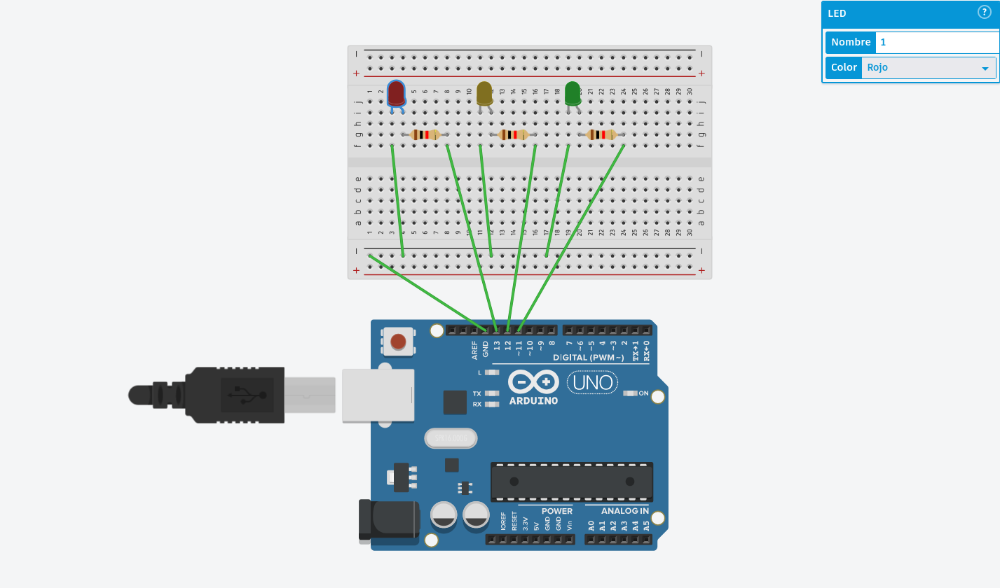
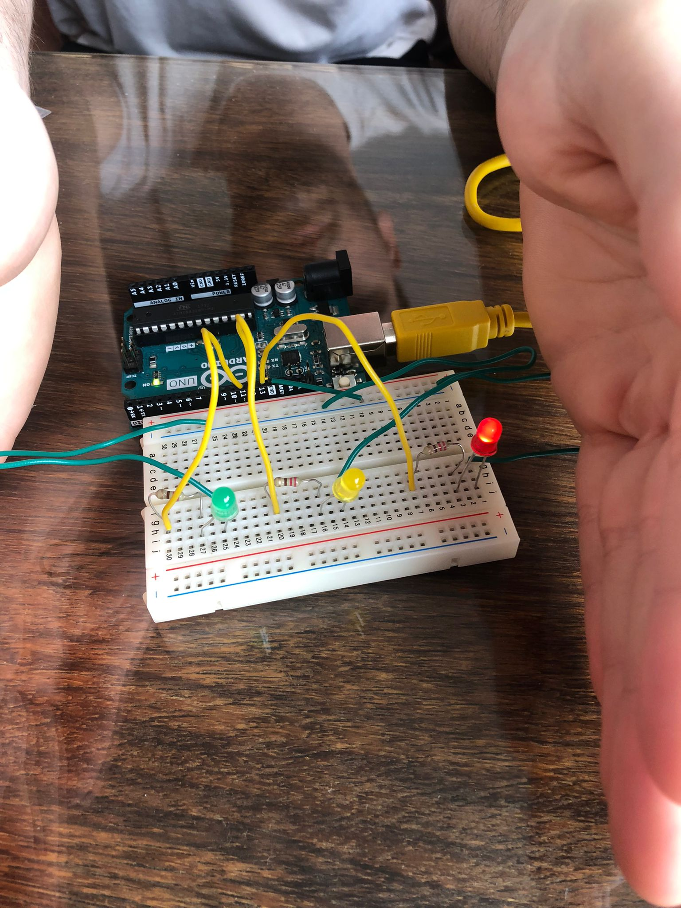
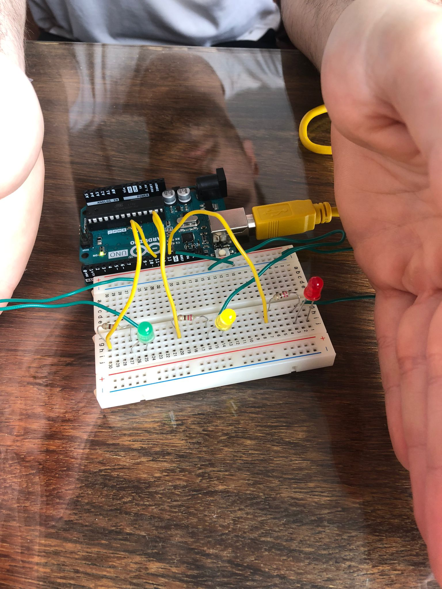
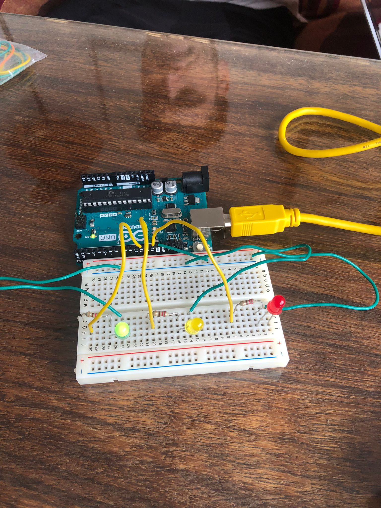
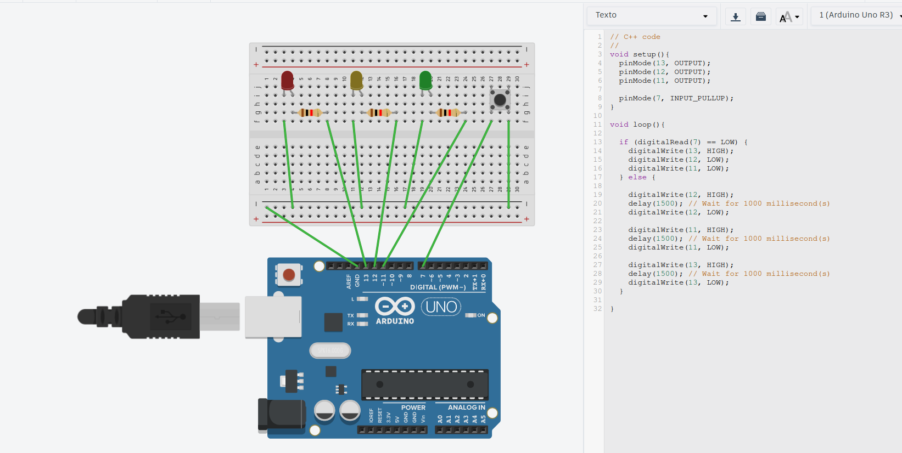
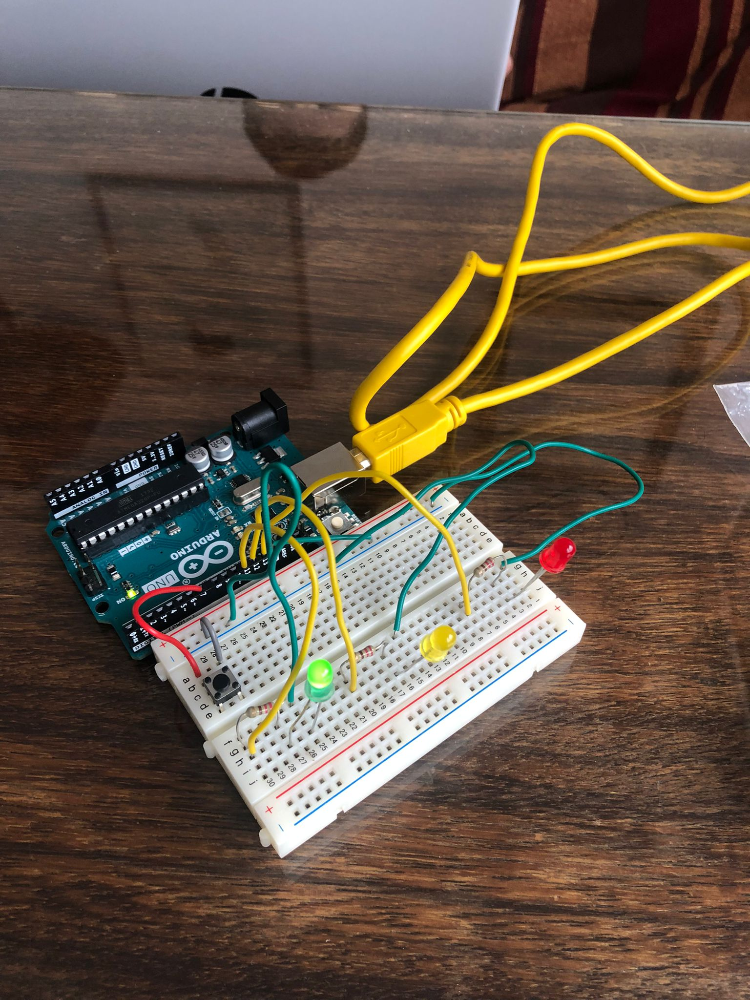
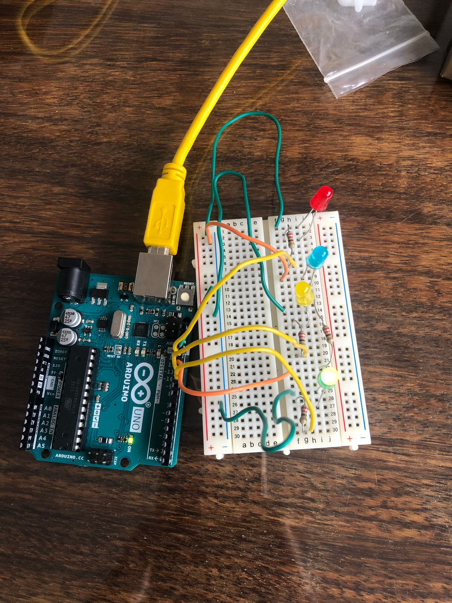
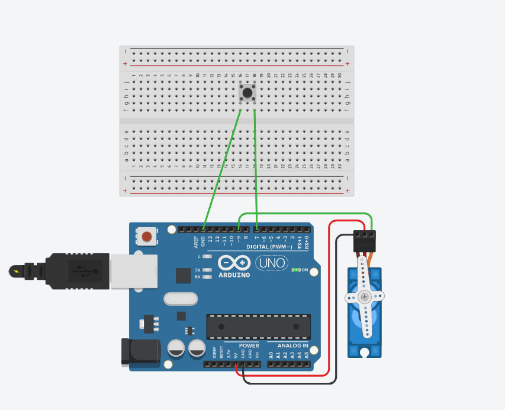
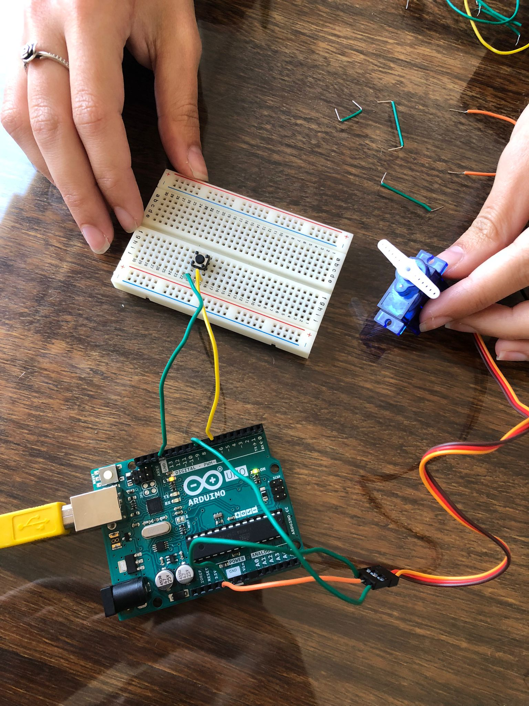

# Práctica 3: Experimentación con Arduino

**Autores:** Inés Prados y Darío Ortega  
**Asignatura:** Programación de Dispositivos e Interfaz de Hardware (PDIH)  
**Universidad de Granada**

---

## Objetivo

El objetivo principal de esta práctica es la configuración del dispositivo Arduino para realizar programas básicos de entrada/salida, utilizando componentes electrónicos como LEDs, pulsadores, sensores analógicos y motores.

---

## 1. Ejercicio 1: Secuencia de Tres LEDs

El objetivo de este proyecto es hacer parpadear tres LEDs (rojo, amarillo y verde) de forma secuencial, con un intervalo de 1.5 segundos entre cada encendido.

### Componentes Utilizados

| Componente | Cantidad | Descripción |
|---|---|---|
| Placa Arduino UNO | 1x | Microcontrolador principal |
| Breadboard | 1x | Placa de prototipado |
| LED Rojo | 1x | Conectado al pin digital 13 |
| LED Amarillo | 1x | Conectado al pin digital 12 |
| LED Verde | 1x | Conectado al pin digital 11 |
| Resistencia 220Ω–330Ω | 3x | Limitadoras de corriente para los LEDs |
| Cables de conexión | varios | Jumpers macho-macho |

### Esquema de Conexiones (Tinkercad)



### Código Fuente Documentado

```cpp
// Pin 13 → LED Rojo (salida digital)
// Pin 12 → LED Amarillo (salida digital)
// Pin 11 → LED Verde (salida digital)

void setup() {
  pinMode(13, OUTPUT);
  pinMode(12, OUTPUT);
  pinMode(11, OUTPUT);
}

void loop() {
  digitalWrite(13, HIGH);
  delay(1500); // LED Rojo encendido 1.5 segundos
  digitalWrite(13, LOW);

  digitalWrite(12, HIGH);
  delay(1500); // LED Amarillo encendido 1.5 segundos
  digitalWrite(12, LOW);

  digitalWrite(11, HIGH);
  delay(1500); // LED Verde encendido 1.5 segundos
  digitalWrite(11, LOW);
}
```

### Demostración Física

Montaje físico funcionando en los tres estados de la secuencia:

| LED Rojo | LED Amarillo | LED Verde |
|:---:|:---:|:---:|
|  |  |  |

🎥 [Ver vídeo demostrativo del Ejercicio 1](ej1_tres_leds/video_ej1.mp4)

---

## 2. Ejercicio 2: LEDs con Interruptor

Modificación del circuito anterior para que la secuencia se detenga y únicamente el LED rojo quede encendido cuando se mantenga pulsado un botón conectado al pin digital 7.

### Componentes Utilizados

| Componente | Cantidad | Descripción |
|---|---|---|
| Placa Arduino UNO | 1x | Microcontrolador principal |
| Breadboard | 1x | Placa de prototipado |
| LED Rojo | 1x | Conectado al pin digital 13 |
| LED Amarillo | 1x | Conectado al pin digital 12 |
| LED Verde | 1x | Conectado al pin digital 11 |
| Resistencia 220Ω–330Ω | 3x | Limitadoras de corriente para los LEDs |
| Pulsador (Push Button) | 1x | Conectado al pin digital 7 con INPUT_PULLUP |
| Cables de conexión | varios | Jumpers macho-macho |

### Esquema de Conexiones (Tinkercad)



### Código Fuente Documentado

```cpp
// Pin 13 → LED Rojo (salida digital)
// Pin 12 → LED Amarillo (salida digital)
// Pin 11 → LED Verde (salida digital)
// Pin 7  → Pulsador (entrada con resistencia pull-up interna)
//          LOW = pulsado, HIGH = libre

void setup() {
  pinMode(13, OUTPUT);
  pinMode(12, OUTPUT);
  pinMode(11, OUTPUT);
  pinMode(7, INPUT_PULLUP); // Pull-up interno: no necesita resistencia externa
}

void loop() {
  if (digitalRead(7) == LOW) {
    // Botón pulsado: solo LED Rojo encendido
    digitalWrite(13, HIGH);
    digitalWrite(12, LOW);
    digitalWrite(11, LOW);
  } else {
    // Botón libre: secuencia normal
    digitalWrite(12, HIGH);
    delay(1500);
    digitalWrite(12, LOW);

    digitalWrite(11, HIGH);
    delay(1500);
    digitalWrite(11, LOW);

    digitalWrite(13, HIGH);
    delay(1500);
    digitalWrite(13, LOW);
  }
}
```

### Demostración Física



🎥 [Ver vídeo demostrativo del Ejercicio 2](ej2_leds_interruptor/video_ej2.mp4)

---

## 3. Extra 1: Secuencia "Coche Fantástico"

Implementación de un efecto visual de barrido de ida y vuelta utilizando 4 LEDs consecutivos, similar al efecto del coche fantástico (KITT).

### Componentes Utilizados

| Componente | Cantidad | Descripción |
|---|---|---|
| Placa Arduino UNO | 1x | Microcontrolador principal |
| Breadboard | 1x | Placa de prototipado |
| LEDs | 4x | Conectados a los pines digitales 10, 11, 12 y 13 |
| Resistencias 220Ω–330Ω | 4x | Limitadoras de corriente |
| Cables de conexión | varios | Jumpers macho-macho |

### Código Fuente Documentado

```cpp
// Pines 10, 11, 12, 13 → LEDs en orden de izquierda a derecha (salidas digitales)
int leds[] = {10, 11, 12, 13};

void setup() {
  for (int i = 0; i < 4; i++) {
    pinMode(leds[i], OUTPUT);
  }
}

void loop() {
  // Recorrido de ida: de izquierda (10) a derecha (13)
  for (int i = 0; i < 4; i++) {
    digitalWrite(leds[i], HIGH);
    delay(200);
    digitalWrite(leds[i], LOW);
  }

  // Recorrido de vuelta: de derecha a izquierda (sin repetir extremos)
  for (int i = 2; i > 0; i--) {
    digitalWrite(leds[i], HIGH);
    delay(200);
    digitalWrite(leds[i], LOW);
  }
}
```

### Demostración Física



🎥 [Ver vídeo demostrativo del Extra 1](extra1_coche_fantastico/video_extra1.mp4)

---

## 4. Extra 2: Detector de Distancia (Ultrasonidos)

Uso del sensor HC-SR04 para calcular la distancia a un objeto y activar un buzzer cuando el objeto se encuentra a menos de 20 cm.

### Componentes Utilizados

| Componente | Cantidad | Descripción |
|---|---|---|
| Placa Arduino UNO | 1x | Microcontrolador principal |
| Breadboard | 1x | Placa de prototipado |
| Sensor HC-SR04 | 1x | Sensor de ultrasonidos (Trigger: pin 9, Echo: pin 8) |
| Buzzer piezoeléctrico | 1x | Emisor de sonido (pin 6) |
| Cables de conexión | varios | Jumpers macho-macho |

### Esquema de Conexiones (Tinkercad)


### Código Fuente Documentado

```cpp
// Pin 9 → Trigger del HC-SR04 (salida digital): envía el pulso ultrasónico
// Pin 8 → Echo del HC-SR04 (entrada digital): recibe el eco de vuelta
// Pin 6 → Buzzer piezoeléctrico (salida digital)

int trig = 9;
int echo = 8;
int buzzer = 6;

void setup() {
  pinMode(trig, OUTPUT);
  pinMode(echo, INPUT);
  pinMode(buzzer, OUTPUT);
}

void loop() {
  long duracion;
  int distancia;

  // Generamos un pulso ultrasónico de 10 µs
  digitalWrite(trig, LOW);
  delayMicroseconds(2);
  digitalWrite(trig, HIGH);
  delayMicroseconds(10);
  digitalWrite(trig, LOW);

  // Medimos el tiempo del eco y calculamos la distancia en cm
  // distancia = (duracion × velocidad_sonido) / 2 = duracion × 0.034 / 2
  duracion = pulseIn(echo, HIGH);
  distancia = duracion * 0.034 / 2;

  // Si el objeto está a menos de 20 cm, activamos el buzzer
  if (distancia < 20) {
    tone(buzzer, 1000);
  } else {
    noTone(buzzer);
  }

  delay(200);
}
```

### Demostración Física


🎥 [Ver vídeo demostrativo del Extra 2](extra2_ultrasonidos/video_extra2.mp4)

---

## 5. Extra 3: Fotosensor Automático (Farola)

Uso de una fotorresistencia (LDR) y un divisor de tensión para detectar niveles de oscuridad y activar un LED de forma automática, simulando el comportamiento de una farola.

### Componentes Utilizados

| Componente | Cantidad | Descripción |
|---|---|---|
| Placa Arduino UNO | 1x | Microcontrolador principal |
| Breadboard | 1x | Placa de prototipado |
| Fotorresistencia (LDR) | 1x | Sensor de luz — divisor de tensión con pin A0 |
| Resistencia 10kΩ | 1x | Resistencia de pull-down para el divisor de tensión |
| LED | 1x | Indicador luminoso — pin digital 9 |
| Resistencia 220Ω | 1x | Limitadora de corriente del LED |
| Cables de conexión | varios | Jumpers macho-macho |

### Esquema de Conexiones (Tinkercad)


### Código Fuente Documentado

```cpp
// Pin A0 → LDR (entrada analógica): lee el nivel de luz ambiente (0–1023)
// Pin 9  → LED (salida digital): se enciende cuando hay oscuridad

const int pinLDR = A0;
const int pinLed = 9;

// Umbral ajustado experimentalmente con el Monitor Serie.
// Por debajo de este valor se considera "de noche" y se enciende el LED.
const int umbralOscuridad = 1000;

void setup() {
  pinMode(pinLed, OUTPUT);
  Serial.begin(9600); // Monitor Serie para calibrar el umbral
}

void loop() {
  // Leemos el nivel de luz (0 = oscuridad total, 1023 = luz máxima)
  int nivelLuz = analogRead(pinLDR);

  Serial.print("Nivel de luz actual: ");
  Serial.println(nivelLuz);

  if (nivelLuz < umbralOscuridad) {
    digitalWrite(pinLed, HIGH); // Oscuro → farola encendida
  } else {
    digitalWrite(pinLed, LOW);  // Hay luz → farola apagada
  }

  delay(100); // Pausa para no saturar el Monitor Serie
}
```

### Demostración Física

🎥 [Ver vídeo demostrativo del Extra 3](extra3_fotosensor/video_extra3.mp4)

---

## 6. Extra 4: Control de Servo Motor con Pulsador

Activación de un servo motor mediante un pulsador: al pulsar el botón el servo gira a 90°, y al soltarlo vuelve a la posición inicial (0°).

### Componentes Utilizados

| Componente | Cantidad | Descripción |
|---|---|---|
| Placa Arduino UNO | 1x | Microcontrolador principal |
| Breadboard | 1x | Placa de prototipado |
| Servo Motor SG90 | 1x | Conectado al pin digital 9 (señal PWM) |
| Pulsador (Push Button) | 1x | Conectado al pin digital 7 con INPUT_PULLUP |
| Cables de conexión | varios | Jumpers macho-macho |

### Esquema de Conexiones (Tinkercad)



### Código Fuente Documentado

```cpp
#include <Servo.h>

// Pin 9 → Señal de control del servo (salida PWM)
// Pin 7 → Pulsador (entrada con pull-up interno)
//         LOW = pulsado, HIGH = libre

Servo motor;
int boton = 7;

void setup() {
  motor.attach(9);              // Conectamos el servo al pin 9
  pinMode(boton, INPUT_PULLUP); // Pull-up interno activado
}

void loop() {
  if (digitalRead(boton) == LOW) {
    motor.write(90); // Botón pulsado → servo gira a 90°
  } else {
    motor.write(0);  // Botón libre → servo vuelve a posición inicial (0°)
  }
}
```

### Demostración Física



🎥 [Ver vídeo demostrativo del Extra 4](extra4_motor/video_extra4.mp4)

---

*Práctica realizada con Arduino UNO y simulación previa en [Tinkercad Circuits](https://www.tinkercad.com/circuits).*
