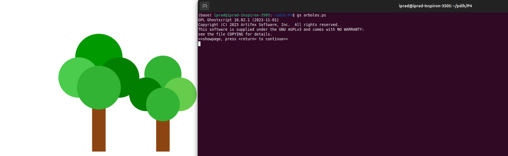
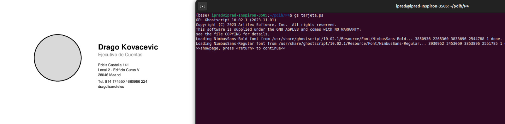
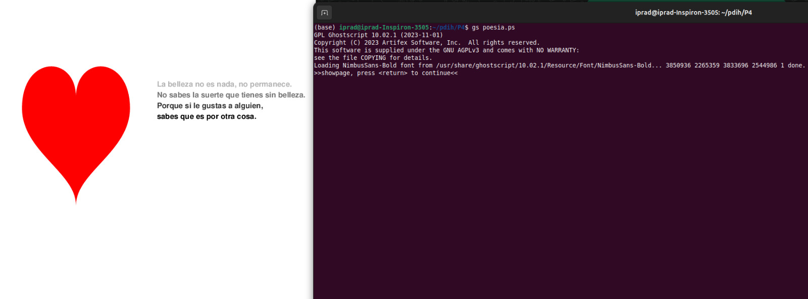
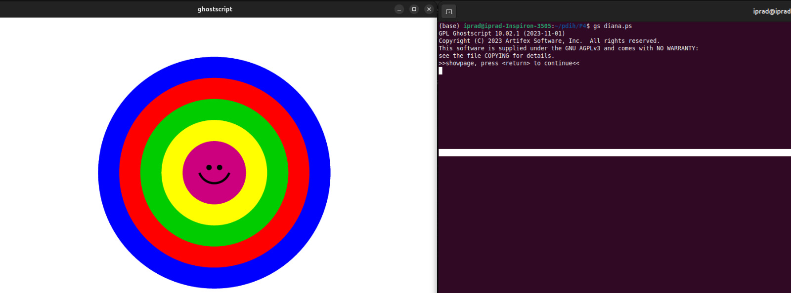
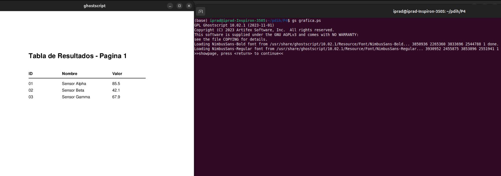

# Práctica 4: El lenguaje Postscript

**Autores:** Inés Prados y Darío Ortega
**Asignatura:** Programación de Dispositivos e Interfaz de Hardware (PDIH)

---

## 1. Introducción
El objetivo de esta práctica es conocer y aplicar la sintaxis básica del lenguaje de descripción de página PostScript (PS). A través de una serie de ejercicios, hemos programado pequeños archivos de texto plano con instrucciones vectoriales (`newpath`, `moveto`, `lineto`, `arc`, `fill`, `stroke`) para definir gráficos, textos y colores.

Para visualizar los resultados hemos convertido los archivos a formato PDF utilizando la herramienta `ps2pdf` (Ghostscript).

---

## 2. Ejercicios Obligatorios

### 2.1. Dibujo de Árboles
**Archivos:** `arboles.ps` y `arboles.pdf`
Se ha programado una página que dibuja una composición de árboles utilizando primitivas geométricas (círculos y rectángulos) combinando colores planos. 

**Resultado:**

### 2.2. Tarjeta de Visita
**Archivos:** `tarjeta.ps` y `tarjeta.pdf`
En este ejercicio se ha maquetado una tarjeta de visita profesional. Se ha hecho uso de la carga de tipografías (`findfont`, `scalefont`, `setfont`) y el posicionado preciso del cursor (`moveto`) para distribuir el texto.

**Resultado:**

### 2.3. Corazón y Poesía
**Archivos:** `poesia.ps` y `poesia.pdf`
Se ha renderizado una figura compleja (un corazón) junto a un bloque de texto poético. Para el corazón se ha utilizado color rojo puro mediante la instrucción `setrgbcolor`.

**Resultado:**

---

## 3. Ejercicios Ampliados (Extras)

### 3.1. Círculos Concéntricos de Colores (Diana)
**Archivos:** `diana.ps` y `diana.pdf`
Se han dibujado múltiples círculos concéntricos de colores iterando sobre la orden `arc` y `fill` para crear una diana.

**Resultado:**

### 3.2. Dos páginas (Tabla y Gráfica)
**Archivos:** `grafica.ps` y `grafica.pdf`
Se ha creado un documento de dos páginas utilizando el comando `showpage` como separador. La primera página contiene una tabla de datos alineada, y la segunda una gráfica de líneas que representa dichos valores.

**Resultado:**

