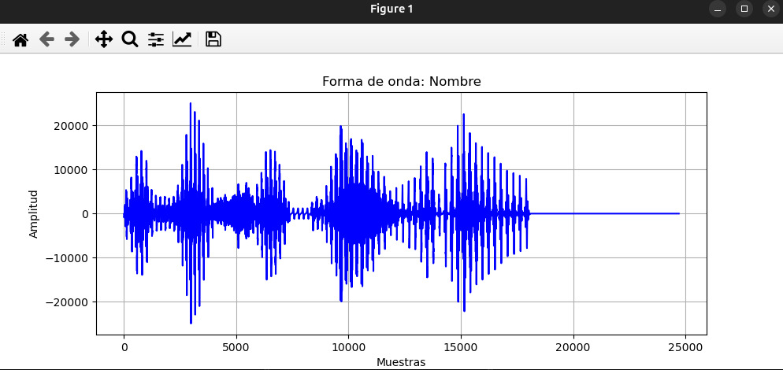
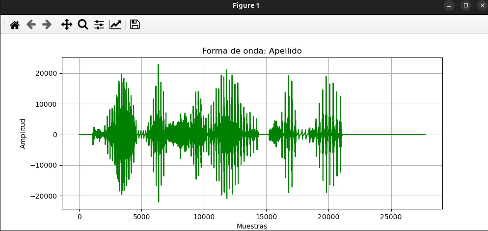
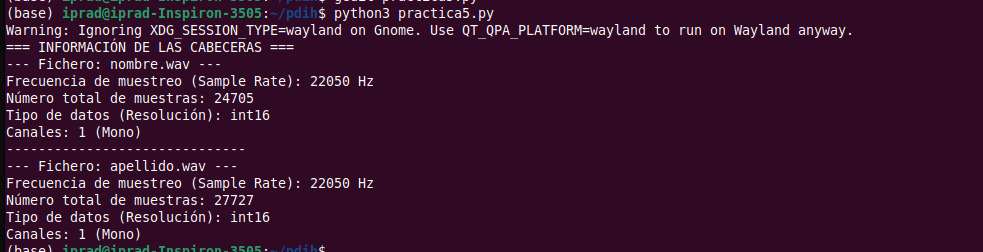
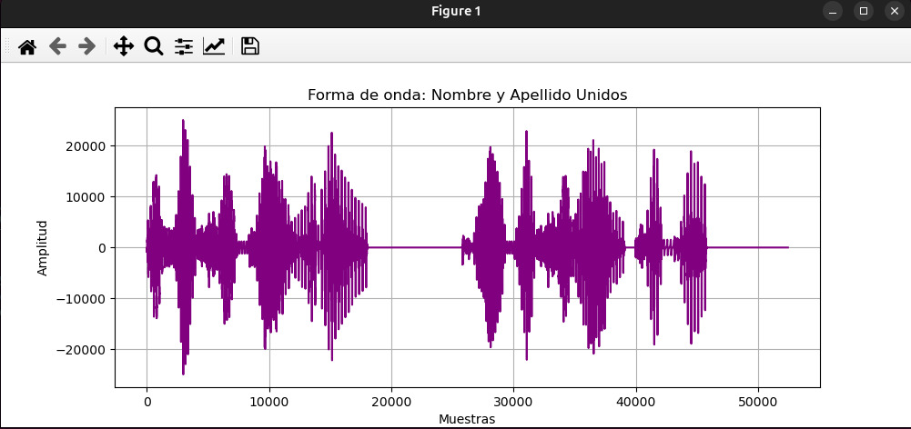
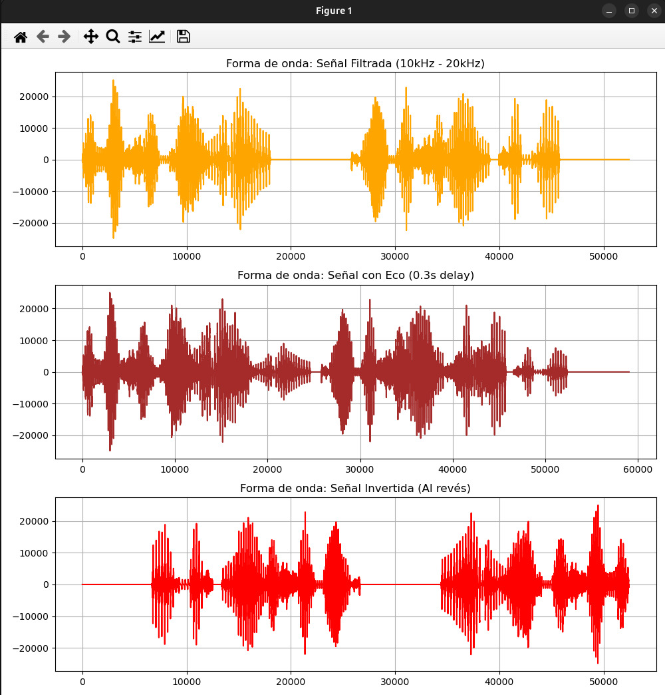
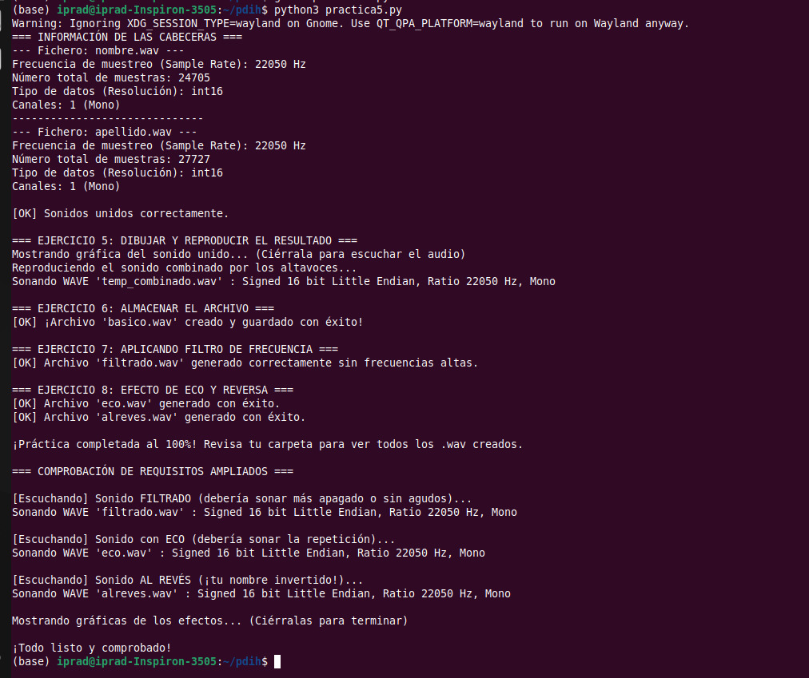

# Práctica 5: Experimentación con el sistema de salida de sonido

**Autores:** Inés Prados y Darío Ortega Leyva  
**Asignatura:** Programación de Dispositivos e Interfaz de Hardware (PDIH)

---

## 1. Introducción
[cite_start]El objetivo principal de esta práctica es aprender a reproducir, crear, modificar y manejar sonidos usando el lenguaje elegido[cite: 310]. En nuestro caso, hemos desarrollado un script completo en **Python** para procesar los archivos de audio y generar las gráficas solicitadas.

---

## 2. Requisitos Mínimos

### Ejercicio 1: Creación de ficheros de sonido
[cite_start]Se han generado dos ficheros en formato WAV: uno en el que se escucha el nombre y otro en el que se escucha el apellido[cite: 313, 314, 315].
*(Se adjunta un archivo `video.mp4` en el repositorio mostrando la reproducción de los audios generados).*

### Ejercicio 2: Forma de onda de los audios originales
[cite_start]Hemos leído los dos ficheros de sonido creados y dibujado la forma de onda de ambos sonidos por separado usando las librerías de Python[cite: 318].

**Forma de onda (Nombre):**

**Forma de onda (Apellido):**

### Ejercicio 3: Información de las Cabeceras
[cite_start]El programa extrae por consola los parámetros fundamentales de las cabeceras de ambos archivos de sonido [cite: 319] (Sample Rate, Canales, Resolución, etc.):

### Ejercicios 4, 5 y 6: Unión, Reproducción y Guardado
[cite_start]Tras leer ambos ficheros, el programa une ambos sonidos en uno nuevo para escuchar el nombre y apellido correctamente[cite: 320, 321]. [cite_start]A continuación, se dibuja la forma de onda resultante, se reproduce el sonido por los altavoces [cite: 322] [cite_start]y finalmente se almacena el resultado en un archivo nuevo llamado `basico.wav`[cite: 323].

**Forma de onda (Sonido Unido):**

---

## 3. Requisitos Ampliados (Opcionales)

### Ejercicio 7: Filtro de frecuencia
[cite_start]Se ha implementado un filtro para eliminar las frecuencias altas comprendidas entre 10.000Hz y 20.000Hz de la pista de audio unida[cite: 325]. [cite_start]La señal resultante se ha guardado correctamente como `filtrado.wav`[cite: 326].

### Ejercicio 8: Efectos de Eco y Reverso
[cite_start]Partiendo del fichero unificado `basico.wav`, se ha aplicado un efecto de retraso acústico para generar eco, guardando el resultado en un nuevo archivo llamado `eco.wav`[cite: 327, 328]. [cite_start]Posteriormente, se ha invertido temporalmente la señal (reproducción al revés) y se ha almacenado como `alreves.wav`[cite: 328].

**Gráficas de los Efectos (Filtro, Eco y Reverso):**

---

## 4. Ejecución Completa del Script
A continuación, se muestra una captura de la ejecución ininterrumpida de nuestro programa `practica5.py`, donde se puede comprobar que todas las funciones, uniones y efectos se realizan de forma secuencial y sin errores:

