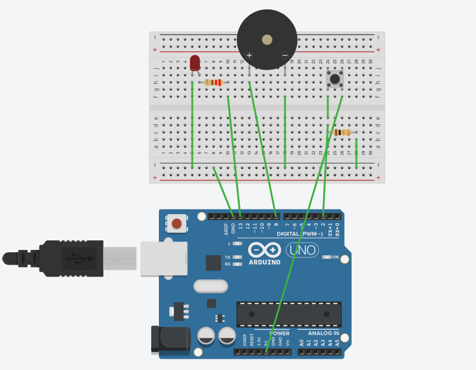

# Traductor Bidireccional de Código Morse con Arduino

**Autores:** Inés Prados y Darío Ortega Leyva  
**Asignatura:** Programación de Dispositivos e Interfaz de Hardware (PDIH)

---

## 1. Introducción e Historia
El código Morse es un sistema de representación de letras y números mediante señales emitidas de forma intermitente. Fue el pilar de las comunicaciones globales durante más de un siglo. En este proyecto, hemos diseñado un sistema que permite a un usuario moderno interactuar con esta tecnología clásica, utilizando una placa Arduino como puente entre el teclado de un PC y un pulsador físico.

## 2. Reglas del Sistema (Timings)
Para que el código sea legible, hemos definido los siguientes tiempos base en el software:
* **Punto (`.`):** Pulsación inferior a 250ms.
* **Raya (`-`):** Pulsación superior a 250ms.
* **Fin de letra:** Silencio superior a 1000ms (1 segundo).
* **Frecuencia acústica:** Tono de 1000Hz emitido por el zumbador.

## 3. Arquitectura de Hardware
El montaje se basa en una configuración de entrada/salida digital:
* **Entrada (Pin 2):** Pulsador conectado en modo digital (requiere resistencia Pull-Down externa de 10kΩ).
* **Salida Visual (Pin 13):** LED integrado y/o externo.
* **Salida Sonora (Pin 8):** Zumbador (Buzzer) piezoeléctrico.

**Esquema de conexiones:**

## 4. Código Fuente
El código principal del sistema, que permite la comunicación bidireccional (PC a Arduino y Arduino a PC), se encuentra en la carpeta `codigo_morse` de este directorio. 

> **[Ver el código fuente (codigo_morse.ino)](codigo_morse.ino)**

## 5. Pruebas y Resultados
El sistema ha sido validado mediante tres pruebas de fuego que se realizarán durante la presentación:

### A. Prueba de Emergencia (SOS)
* **Entrada:** Se escribe `"SOS"` en la consola del PC.
* **Salida:** El sistema emite tres pitidos cortos, tres largos y tres cortos. Sirve para demostrar el control de tiempos del diccionario.
* **Resultado:** ✅ Éxito. La cadencia es constante y perfectamente reconocible.

### B. Prueba de Identidad (PDIH)
* **Entrada:** Escribimos las siglas de la asignatura.
* **Desafío:** Es una combinación compleja (`.--. -.. .. ....`).
* **Resultado:** ✅ Sirve para demostrar el uso de pausas entre letras y cómo el búfer de salida no se satura.

### C. Modo Telégrafo Manual
* **Acción:** El usuario pulsa manualmente el botón para escribir su nombre.
* **Ejemplo:** Pulsación corta (punto) + Pulsación larga (raya) + Silencio de 1s.
* **Resultado:** ✅ El monitor serie muestra con precisión `.- -> A`. El filtro de 50ms evita que las vibraciones mecánicas del botón generen señales falsas.

## 6. Conclusiones
El trabajo cumple con los objetivos de la asignatura PDIH al integrar conceptos de temporización de sistemas (`millis`), gestión de arrays de caracteres y control de periféricos de hardware. La capacidad de interactuar mediante el puerto serie y hardware físico simultáneamente aporta un valor añadido al proyecto.
